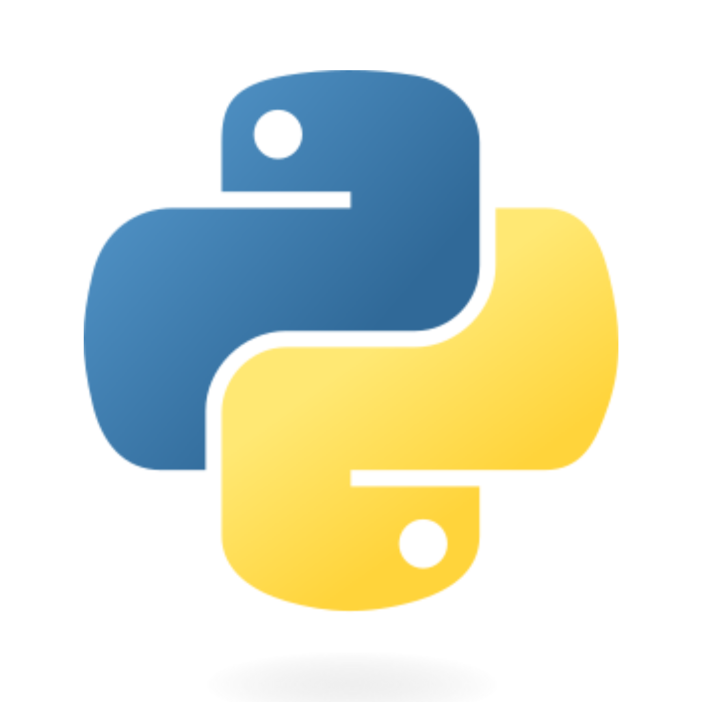

# **Day 01**

## **Introduction to Python**

{ align=left width=150 }
<p style="text-align: justify;">Python is a high-level, interpreted programming language known for its clear syntax and readability. Created by Guido van Rossum and first released in 1991, Python's design philosophy emphasizes code readability with its notable use of significant whitespace.</p>

<p style="text-align: justify;">Its versatile nature allows Python to be used in various domains, such as web development, data analysis, artificial intelligence, machine learning, automation, and scientific computing. Companies like Google, Netflix, and Facebook use Python for a wide range of purposes, demonstrating its adaptability and power.</p>

<p style="text-align: justify;">With a rich ecosystem of libraries and frameworks, Python makes it possible to work on complex tasks with relatively simple and understandable code, making it a popular choice for beginners and experts alike.</p>

You can also download the Complete Day 01 Notes from [Here](assets/pdfs/Day%2001.pdf)

## **Features of Python**

Python is known for its numerous appealing features which contribute to its popularity among programmers. Below are some of the most notable features:

- **Ease of Learning and Readability**: Python's syntax is clear and intuitive, making it an ideal choice for beginners.
- **Expressive**: More functionality can be achieved with fewer lines of code.
- **Interpreted**: Python code is executed line by line, which makes debugging easier.
- **Cross-platform**: It runs on multiple operating systems like Windows, macOS, and Linux.
- **Open Source**: Python is freely available and can be distributed and modified, benefiting from community contributions.
- **Extensive Libraries**: A vast standard library provides modules for numerous functionalities.
- **Object-Oriented**: Python supports OOP with classes and objects.
- **Integration**: It can be integrated with languages like C and C++.
- **Dynamic Typing**: Python does dynamic type checking.
- **Extensibility**: Programmers can add low-level modules to the Python interpreter.
- **Database Connectivity**: It supports interaction with most databases.
- **Automatic Memory Management**: Features garbage collection to manage memory usage.

## **First Python Program**

Python is known for its straightforward syntax that is similar to the English language. Here's how you can write and run your first Python program.

### Writing Your First Program

Create a new text file with the `.py` extension, for example, `hello.py`. Then, open it in a text editor and write your first program:

```python
# hello.py
print("Hello, Broadridge!")
```

This program uses the print() function to send the output to the screen.

### Running Your First Program

To run your Python program, open your command prompt or terminal, navigate to the directory containing your hello.py file, and then type:

```bash
python hello.py
```

If Python is installed correctly and the PATH is set, you should see the following output:

```bash
Hello, Broadridge!

```

!!! success
    **Congratulations!** You've just written and run your first Python program.


In Python, the basic syntax is simple and clean, which makes the code very easy to read and write. Here's an overview of the basic syntax, variables, and data types in Python:

## **Basic Syntax**

- **Comments**: Use the hash symbol (#) for single-line comments. For multi-line comments, you can use triple quotes (''' or """).
- **Indentation**: Python uses indentation to define blocks of code. The standard practice is to use 4 spaces per indentation level.
- **Case Sensitivity**: Python is case-sensitive. For example, Variable and variable are two different identifiers.
- **Statements**: Instructions that a Python interpreter can execute are called statements. For example, print("Hello, world!") is a statement.

For Example,

```py linenums="1"
# basic syntax.py

# Single Line Comment

"""
Line 1
Line 2
Line 3
Multi-Line Comment
"""


def hello():
    print("Hello, Broadridge")  # Observe Indentation


variable = 10
VARIABLE = "A"

if variable == VARIABLE:
    print("True")  # Observe Indentation
else:
    print("False")


print("Bingo!")  # Statements
print("Python is Awsome!")  # Statements
```
  
## **Variables**

- **Declaration**: Variables do not need explicit declaration to reserve memory space. The declaration happens automatically when you assign a value to a variable. E.g., x = 10.
- **Dynamic Typing**: Python is dynamically-typed, which means you can reassign variables to different data types. E.g., x = "Hello" is valid even after x = 10.
- **Immutable Variables**: Some of Python's internal data types, like strings and numbers, are immutable, meaning their contents cannot be changed after they are created.

For Example,

```python linenums="1"
# variables.py

x = 10
print(x)

x = "hello"
print(x)

```

## **Data Types**

### **Primitive Types**

- **Numbers**: Integers (int), floating-point numbers (float), and complex numbers (complex).
- **Strings**: Ordered sequences of characters, e.g., "Hello, world!".
- **Booleans**: Represents True or False values.

### **Data Structures**

- **Lists**: Ordered and mutable collections, e.g., [1, 2, 3].
- **Tuples**: Ordered and immutable collections, e.g., (1, 2, 3).
- **Dictionaries**: Unordered and mutable collections of key-value pairs, e.g., {"name": "Alice", "age": 25}.
- **Sets**: Unordered collections of unique elements, e.g., {1, 2, 3}.

!!! info
    To get the type of a Variable or a Data Structure in Python We can use **type(var)** Inbuilt Function

For Example,

```py linenums="1"
# Primitive types

a = 10
print(type(a))

b = 55.55
print(type(b))

c = 1 + 2j
print(c)
print(c.real)
print(c.imag)
print(type(c))

d = "hello"
print(type(d))

e = True
print(type(e))

# Data Structures

f = [1, 2, 3, 4, 5]
print(type(f))

g = (1, 2, 3, 4, 5)
print(type(g))

h = {"a": 1, "b": 2, "c": 3}
print(type(h))

i = {1, 2, 3, 4, 5}
print(type(i))

```

These are the fundamental elements you'll use when starting to code in Python. Remember, Python is designed to be easy to understand and fun to use, which is why its syntax is often considered one of its greatest strengths.

## **Operators in Python**

Python includes several types of operators:

### **Arithmetic Operators** 

Perform mathematical operations like addition (+), subtraction (-), multiplication (*), division (/), modulus (%), exponentiation (**), and floor division (//).

For Example,

```py linenums="1"
# Arithmetic Operators in Python

# Addition
addition = 5 + 3
print("Addition: 5 + 3 =", addition)

# Subtraction
subtraction = 5 - 3
print("Subtraction: 5 - 3 =", subtraction)

# Multiplication
multiplication = 5 * 3
print("Multiplication: 5 * 3 =", multiplication)

# Division
division = 5 / 3
print("Division: 5 / 3 =", division)

# Modulus (Remainder)
modulus = 5 % 3
print("Modulus: 5 % 3 =", modulus)

# Exponentiation (Power)
exponentiation = 5**3
print("Exponentiation: 5 ** 3 =", exponentiation)

# Floor Division
floor_division = 5 // 3
print("Floor Division: 5 // 3 =", floor_division)

```

### **Comparison Operators**

Compare values and include equals (==), not equals (!=), greater than (>), less than (<), greater than or equal to (>=), and less than or equal to (<=).

For Example,

```py linenums="1"
# Comparison Operators in Python

# Equals: ==
equals = 5 == 3
print("Equals: 5 == 3 is", equals)

# Not Equals: !=
not_equals = 5 != 3
print("Not Equals: 5 != 3 is", not_equals)

# Greater than: >
greater_than = 5 > 3
print("Greater than: 5 > 3 is", greater_than)

# Less than: <
less_than = 5 < 3
print("Less than: 5 < 3 is", less_than)

# Greater than or equal to: >=
greater_than_or_equal_to = 5 >= 3
print("Greater than or equal to: 5 >= 3 is", greater_than_or_equal_to)

# Less than or equal to: <=
less_than_or_equal_to = 5 <= 3
print("Less than or equal to: 5 <= 3 is", less_than_or_equal_to)

```

### **Logical Operators**

Used for logical operations, primarily with boolean values, including and, or, and not.

For Example,

```py linenums="1"
# Logical Operators in Python

# Logical AND
logical_and = True and False
print("Logical AND (True and False) is", logical_and)

# Logical OR
logical_or = True or False
print("Logical OR (True or False) is", logical_or)

# Logical NOT
logical_not = not True
print("Logical NOT (not True) is", logical_not)

# Combining Logical Operators
combined_logical = (True and False) or (not False)
print("Combined Logical ((True and False) or (not False)) is", combined_logical)
```

### **Assignment Operators**

Assign values to variables, e.g., =, +=, -=, *=, /=, etc.

For Example,

```py linenums="1"
# Assignment Operators in Python

# Simple Assignment =
x = 10
print("Simple Assignment: x =", x)

# Add AND (+=)
x += 3  # Equivalent to x = x + 3
print("Add AND (+=): x =", x)

# Subtract AND (-=)
x -= 2  # Equivalent to x = x - 2
print("Subtract AND (-=): x =", x)

# Multiply AND (*=)
x *= 2  # Equivalent to x = x * 2
print("Multiply AND (*=): x =", x)

# Divide AND (/=)
x /= 4  # Equivalent to x = x / 4
print("Divide AND (/=): x =", x)

# Modulus AND (%=)
x %= 3  # Equivalent to x = x % 3
print("Modulus AND (%=): x =", x)

# Exponent AND (**=)
x **= 2  # Equivalent to x = x ** 2
print("Exponent AND (**=): x =", x)

# Floor Division AND (//=)
x //= 2  # Equivalent to x = x // 2
print("Floor Division AND (//=): x =", x)
```

### **Identity Operators**

`is` and `is not` check if two variables refer to the same object in memory.

For Example,

```py linenums="1"
# Identity Operators in Python

# 'is' and 'is not' operators

# is: Evaluates to True if the variables on either side of the operator point to the same object # Noqa
x = ["apple", "banana"]
y = ["apple", "banana"]
z = x

print("x is z:", x is z)
print("x is y:", x is y)
print("x == y:", x == y)

# is not: Evaluates to True if the variables on either side of the operator do not point to the same object # Noqa
print("x is not y:", x is not y)

```

### **Membership Operators**

`in` and `not in` check for membership in a sequence, such as lists or strings.

For Example,

```py linenums="1"
# Membership Operators in Python

# 'in' and 'not in' operators

# in: Evaluates to True if the specified value is found in the sequence
fruits = ["apple", "banana", "cherry"]
print("Is 'apple' in fruits?", "apple" in fruits)
print("Is 'orange' in fruits?", "orange" in fruits)

# not in: Evaluates to True if the specified value is not found in the sequence
print("Is 'mango' not in fruits?", "mango" not in fruits)
print("Is 'banana' not in fruits?", "banana" not in fruits)

```

### **Bitwise Operators**

Perform bitwise calculations on integers, including & (AND), | (OR), ^ (XOR), ~ (NOT), << (left shift), and >> (right shift).

For Example,

```py linenums="1"
# Bitwise Operators in Python

# Bitwise AND (&)
a = 12  # 1100 in binary
b = 15  # 1111 in binary
print("Bitwise AND (a & b):", a & b)  # Result is 1100 in binary which is 12 in decimal

# Bitwise OR (|)
print("Bitwise OR (a | b):", a | b)  # Result is 1111 in binary which is 15 in decimal

# Bitwise XOR (^)
print("Bitwise XOR (a ^ b):", a ^ b)  # Result is 0011 in binary which is 3 in decimal

# Bitwise NOT (~)
print("Bitwise NOT (~a):", ~a)  # Result is -13, which is the two's complement of 12

# Bitwise Left Shift (<<)
print("Bitwise Left Shift (a << 2):", a << 2)  # Left shift the bits of a by 2, result is 48

# Bitwise Right Shift (>>)
print("Bitwise Right Shift (a >> 2):", a >> 2)  # Right shift the bits of a by 2, result is 3

```

## **Functions in Python**

A function is a block of organized, reusable code that is used to perform a single, related action. Functions help break our program into smaller and modular chunks.

Defining a function:

```py linenums="1"
def my_function():
    print("Hello from a function")
```

Calling a function:

```py
my_function()
```

!!! alert "About Functions"
    We will dive Deep into functions in later classes

## **Modules**

A module is a collection of Functions in a Single Python file.

It may also contain classes, and variables, and is used to organize related code. A module is a Python file with a .py extension.

You can use any Python source file as a module by executing an import statement in another Python source file.

```py linenums="1"
import my_module
my_module.my_function()
```

## **Packages**

Packages are collections of modules.

Packages are a way of structuring Python’s module namespace by using “dotted module names.” A package is a directory containing a special file `__init__.py` and can contain subpackages and modules.

```py linenums="1"
import package_name.module_name
```

## **Creating Modules in Python**

**Step 0: Create the directory called (`pack`)**

Navigate to the directory and follow the further steps.

**Step 1: Create the first module (`modone.py`)**

In this module, it consists of two functions, Addition and Multiplication.

```py linenums="1"
def addn(a, b):
    """Addn function for adding two numbers together

    Args:
        a (float): integer or float
        b (float): integer or float

    Returns:
        float: Returns the sum of the two numbers that are passed in as
        arguments to the function for parameters a and b.
    """
    return a + b


def muln(a, b):
    """muln function for Product two numbers together

    Args:
        a (float): integer or float
        b (float): integer or float

    Returns:
        float: Returns the product of the two numbers that are passed in as
        arguments to the function for parameters a and b.
    """
    return a * b

```

**Step 2: Create the second module (`modtwo.py`)**

In this module, it consists of two functions, Subtraction and Division.

```py linenums="1"
def subn(a, b):
    """Subn function for Subtraction two numbers together

    Args:
        a (float): integer or float
        b (float): integer or float

    Returns:
        float: Returns the Subtraction of the two numbers that are passed in as
        arguments to the function for parameters a and b.
    """
    return a - b


def divn(a, b):
    """Division function for dividing two numbers together

    Args:
        a (float): integer or float
        b (float): integer or float

    Returns:
        float: Returns the Quotient of the two numbers that are passed in as
        arguments to the function for parameters a and b.
    """
    return a / b

```

**Step 3: Create a Script to Use the Modules (`callmod.py`)**

```py linenums="1"
import modone
import modtwo

print(modone.addn(9, 8))
print(modone.addn.__doc__)

print(modone.muln(9, 8))
print(modone.muln.__doc__)

print(modtwo.subn(9, 8))
print(modtwo.subn.__doc__)

print(modtwo.divn(9, 8))
print(modtwo.divn.__doc__)
```

**Step 4: Run Your Script (`callmod.py`)**

```bash
python callmod.py
```

Ensure your file are structured as follows in the same directory:

```md
.
├── Project Directory
└── pack/
    ├── modone.py
    ├── modtwo.py
    └── callmod.py
```

## **Creating Packages in Python**

**Step 5: Create an Empty `__init__.py` file in the pack directory**

```bash
touch __init__.py
```

Your directory structure should now look like this:

```md
.
├── Project Directory
└── pack/
    ├── __init___.py
    ├── modone.py
    ├── modtwo.py
    └── callmod.py
```

**Step 6: Use the Package in Your Script (`callpack.py`)**

```py linenums="1"
from pack import modone
from pack import modtwo

print(modone.addn(2, 2))
print(modtwo.divn(2, 0.5))
```

Your directory structure should now look like this at the End:

```md
.
├── Project Directory
├── pack/
│   ├── __init___.py
│   ├── modone.py
│   ├── modtwo.py
│   └── callmod.py
└── callpack.py
```

## **Rules of Python - PEP8 (Python Style Guide)**

PEP 8, or Python Enhancement Proposal 8, is the official style guide for the Python code comprising the conventions that Python developers are advised to follow. Here are some key aspects of PEP 8:

1. **Indentation**: Use 4 spaces per indentation level. Continuation lines should align wrapped elements either vertically, or using a hanging indent of 4 spaces.

2. **Maximum Line Length**: Limit all lines to a maximum of 79 characters for code and 72 characters for comments and docstrings.

3. **Blank Lines**: Use blank lines to separate functions and classes, and larger blocks of code inside functions.

4. **Whitespace in Expressions and Statements** : Avoid extraneous whitespace in the following situations:

    - Immediately inside parentheses, brackets, or braces.
    - Between a trailing comma and a following close parenthesis.
    - Immediately before a comma, semicolon, or colon.
    - However, use whitespace around arithmetic operators.

5. **Comments**: Comments should be complete sentences and should be used sparingly, i.e., only when necessary to explain complex pieces of code.

6. **Naming Conventions**:

    - Functions: Function names should be lowercase, with words separated by underscores as necessary to improve readability.
    - Variables: Use a lowercase single letter, word, or words. Separate words with underscores to improve readability.
    - Classes: Class names should follow the UpperCaseCamelCase convention.
    - Constants: Constants are usually defined on a module level and written in all capital letters with underscores separating words.


PEP 8 is a guideline, not a strict set of rules. It's encouraged to adhere to it, but there can be exceptions based on the context and necessity.