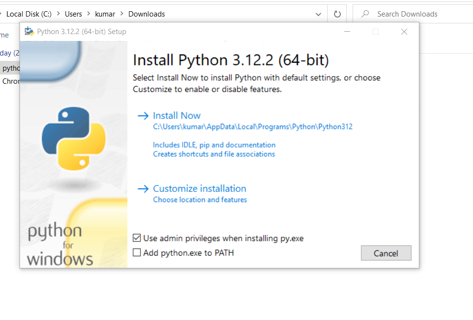
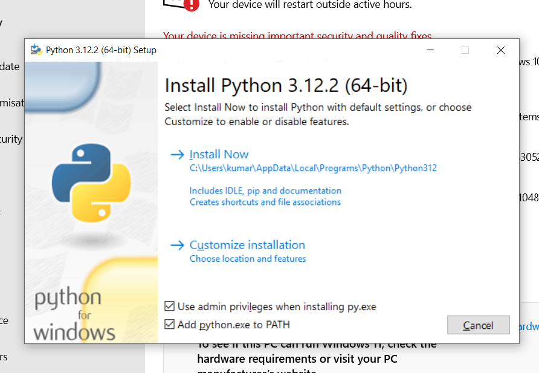
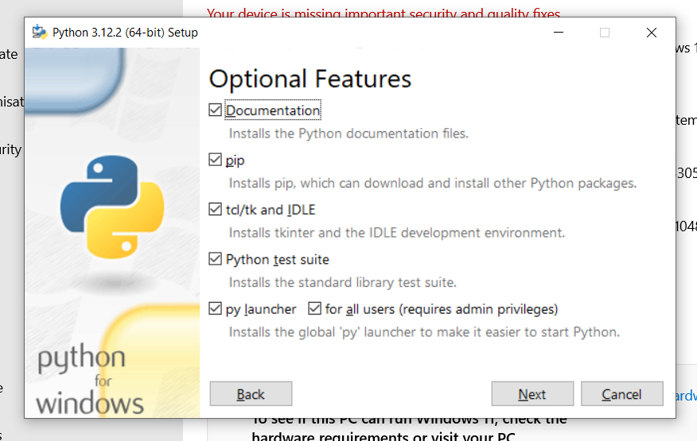
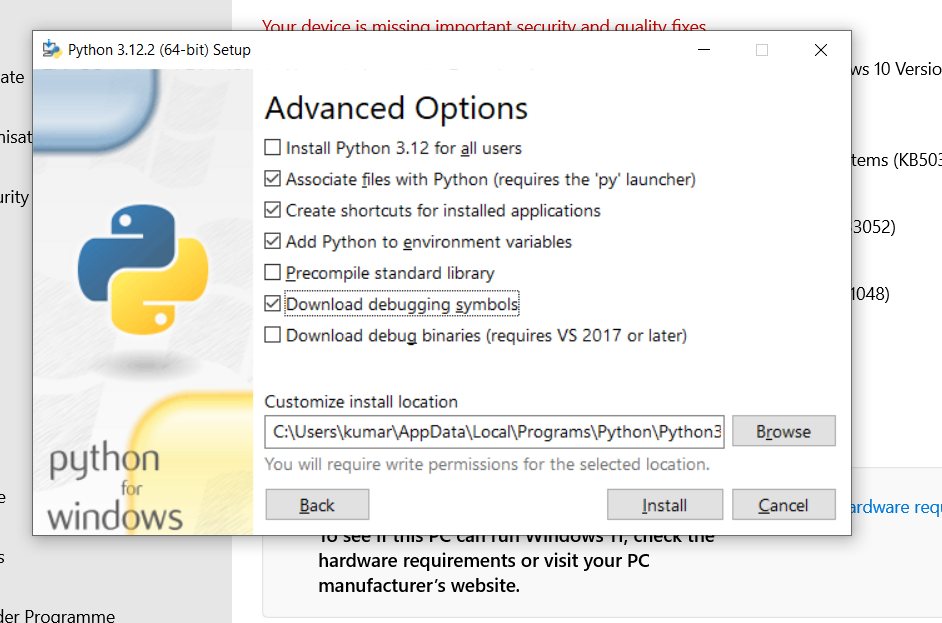
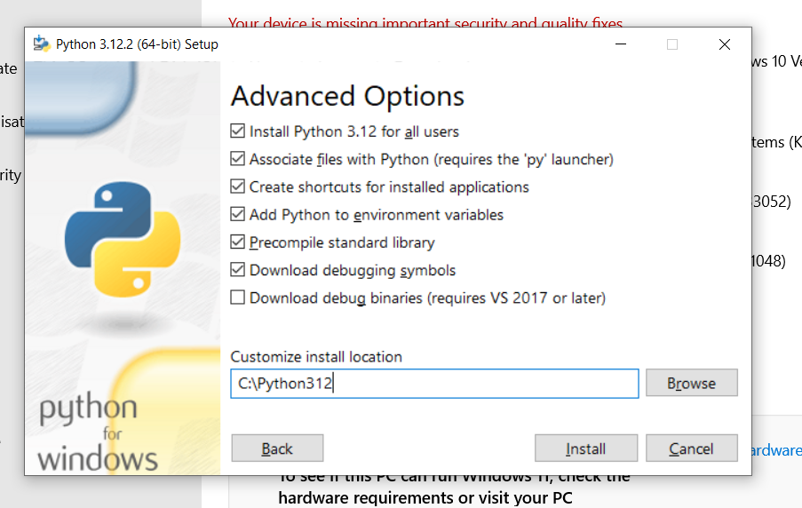

# Get Started

## Welcome to Your Learning Journey

As you embark on this exciting Python training program, you're about to unlock new potentials in programming and data handling. This training is designed to equip you with the skills needed to excel in Python, from basic syntax to advanced applications.

## Before You Begin

To ensure a smooth and productive learning experience, please make sure you meet the following requirements:

- **Hardware**: A PC with at least an i3 processor (or equivalent), 4 GB RAM, and 30 GB of free hard disk space.
- **Software**: Python 3.11 or later, access to a Terminal/Command Line Prompt/Powershell with necessary permissions, and internet access for package installation. Along with your favorite code editor (**Optional**). Consider VS Code and PyCharm (If Required)

## Python Installation Guide for Windows

Follow these steps to install Python on your Windows machine:

### Step 1: Download Python

Navigate to the [official Python website](https://www.python.org/downloads/windows/) and download the latest Windows installer.

### Step 2: Run the Installer

Locate the downloaded file (usually in your `Downloads` folder) and double-click the installer to start the installation process.

### Step 3: Installer Window

- Make sure to check the box that says "Add Python 3.x to PATH" to ensure that the interpreter will be placed in your execution path.
- Then, click on "Install Now" to start the installation with default settings.

### Step 4: Customization (Optional)

- If you need to customize the installation (e.g., change the install location), click on "Customize installation".
- Make sure to check the box that says "Add Python.exe to PATH" to ensure that the interpreter will be placed in your execution path

### Step 5: Optional Features

- You can select or deselect any optional features by checking the corresponding boxes.
- Once you've made your selections, click on "Next".

### Step 6: Advanced Options

- In the "Advanced Options" section, you can choose additional settings such as installing for all users or changing the install location.
- After adjusting the settings to your preference, click on "Install".

### Step 7: Installation

- The installation process will begin. Wait for the progress bar to complete.

### Step 8: Finish Installation

- Once the installation is complete, you should see a screen confirming the successful installation.
- Click on "Close" to finish the installation process.

You've now successfully installed Python on your Windows machine. To verify the installation, open the **Command Prompt** or **Powershell** and type `python --version`. You should see the Python version that you've installed.

## Training Overview

Our program covers a wide array of topics including:

- Python Basics and Advanced Features
- Data Handling and Analysis
- GUI Development
- Deployment on Cloud Platforms

For a detailed schedule and daily topics, please refer to our [Training Agenda](agenda.md).

## Practical Projects

Get hands-on experience with real-world projects, ranging from a simple inventory management system to a dynamic pizza ordering kiosk application. These projects are designed to consolidate your learning and give you a taste of practical Python applications.

Let's dive into the world of Python and explore its endless possibilities!